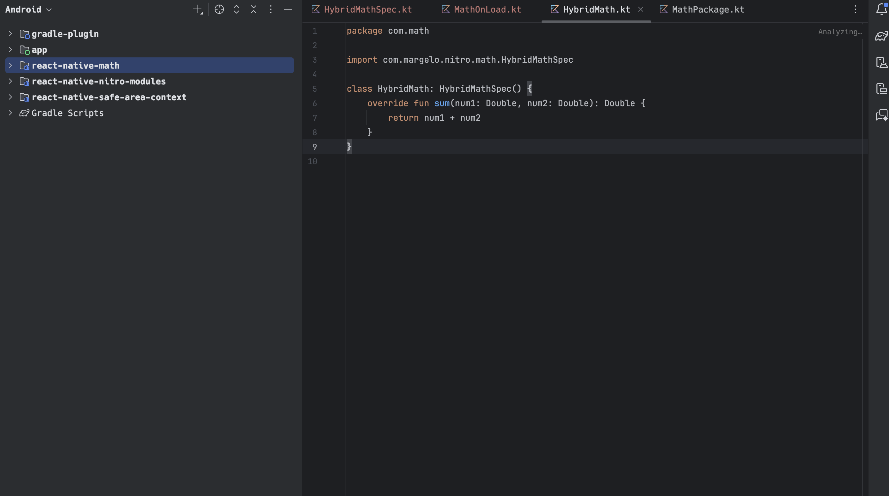
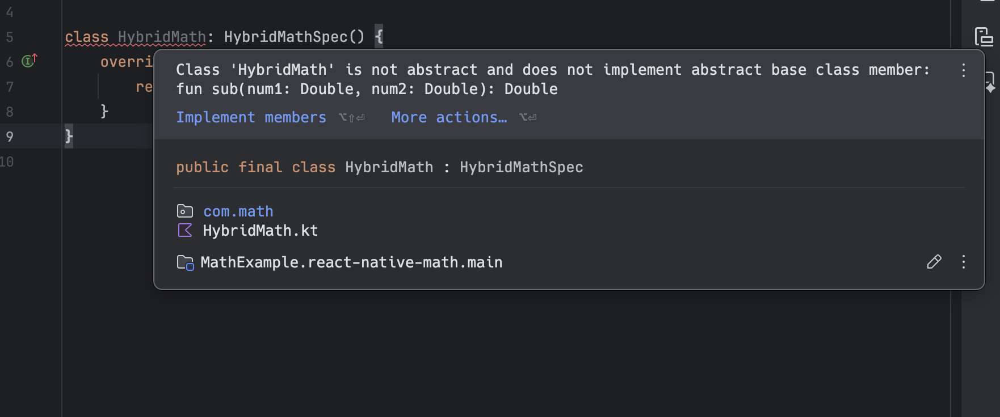

### What is Nitro

So I will quote the main docs of NitroModules to explain what exactly it is : 

> Nitro is a framework for building powerful and fast native modules for JS. Simply put, a JS object can be implemented in C++, Swift or Kotlin instead of JS by using Nitro. 

Now historically speaking (like since the 2022's I dont know how historical is that by coding standards) TurboModules was the defacto way of writing native modules. It boasted better performance than it's predecessor Legacy Native Modules (How it gave these performance boost
is a topic reserved for another post all together).

However in present day the benchmarks tell another story all together. Performance wise Nitro has Turbo beat and hence is slowly becoming the defacto way for people to implement their native modules (You can find the relevant benchmarks over [here](https://github.com/mrousavy/NitroBenchmarks) )

### One benefit (kinda) of TurboModules

TurboModules is what is shipped with react-native core. So for all those particular about not wanting to increase the dependencies in their project this might make Turbo a more convenient choice for them. But for the rest of us who don't care about adding another package with

```bash
npm i react-native-nitro-modules
```
<br>

go ahead and add Nitro to your project.

### Swift Support 

For all you iOS developers this probably could be the most interesting part of Nitro Modules. Nitro Provides swift support compared to Turbo that bridges swift code through Objective-C code. What does this mean for developers is a significant decrease in writing boiler plate code. For Example take a look at this code here : 

```swift
class HybridMath : HybridMathSpec {
  var someValue: Double
}
```
<br>

compared to Turbo's way of doing it : 

```objc
@implementation RTNMath {

  NSNumber* _someValue;
}
RCT_EXPORT_MODULE()

- (NSNumber*)getSomeValue {
  return _someValue;
}
- (void)setSomeValue:(NSNumber*)someValue {
  _someValue = someValue;
}
@end
```
<br>

This is possible because Nitro bridges Swift via a C++ interface

### TypeSafe and Developer UX

Ok enough of theoretical blabbering let's jump into the code and see one of the reasons why developers are liking Nitro so much. To start with we will have to make a nitro module now there are many ways of doing so but we will be using the create-nitro-module for this demonstartion purposes

```bash
npx create-nitro-module@latest
```
<br>

We will be name the package `react-native-math` for simplicity sake. Once generated navigate to the package 

```bash
cd react-native-math
```
<br>

and you will find `node_modules` aleady present as well as the `nitrogen` directory with the bridging-code already generated so for our next step we will navigate to the `example` app directory and install it's dependencies

```bash
cd example/
npm i 
```
<br>

Now with that done we can open the `android` directory in android study and start editing the native code.

```bash
studio android/
```
<br>

Once the project is opened and the gardle sync fianlly finishes (it takes forever sometimes) you will see the following files in your project



Now let's try something fun navigate over to the `math.nitro.ts` file and you will see something like this : 

```ts 

import { type HybridObject } from 'react-native-nitro-modules'

export interface Math extends HybridObject<{ ios: 'swift', android: 'kotlin' }> {
  sum(num1: number, num2: number): number
}
```
<br>

now let's add another function sub that we would like to implement on the native side to subtract a number

```ts 

import { type HybridObject } from 'react-native-nitro-modules'

export interface Math extends HybridObject<{ ios: 'swift', android: 'kotlin' }> {
  sum(num1: number, num2: number): number
  sub(num1: number, num2: number): number
}
```
<br>

After doing this we will have to regenerate the spec files by running 

```bash
npm run codegen
```
<br>

Now if you were to head on over to Android Studio and see the spec file you would see something like this : 


And the best part is now you will be seeing an error like this : 



This is one of the many benefits of running codegen while developing in contrast to what Turbo does and run it only on App compile time.
This provides typesafe and better context for developers jumping back and forth between the TypeScript code and the Native code.

These are just a few of the benefits of using Nitro over Turbo when creating native modules. If you found this interesting and would like to incoporate it into your upcoming projects do give a star to the [Nitro repo](https://github.com/mrousavy/nitro) and to learn more you can always refer to the [Nitro docs](https://nitro.margelo.com/docs/what-is-nitro) they are a good starting point as well.
